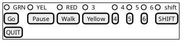
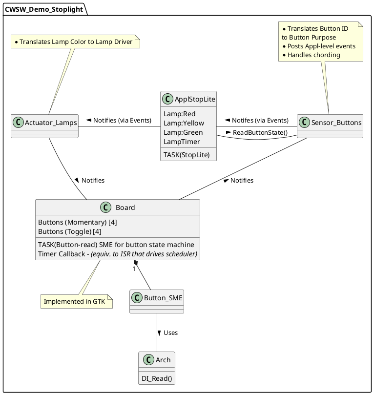

# GTK Board

This board digitizes a hypothetical "getting started" exercise board w/ 8 input buttons and 8 on/off indicators.

I also produces a 1-ms tic that can by used as the CWSW Lib's timer tic input.

Assignments:

For Stop Lamp:

Indicators:
* Ind 0: "Green" lamp
* Ind 1: "Yellow" lamp
* Ind 2: "Red" lamp
* Ind 7: "Shift" indicator

Buttons:
* Btn 0: "Go" (unpause") (debugging / example timer management)
* Btn 1: "Pause" (debugging / example timer management)
* Btn 2: "Walk" input (shortens duration of green, if currently active, and lengthens duration of red, to maintain overall cycle timing)
* Btn 3: "Force Yellow"
* Btn 7: "Shift" - toggle on/off action. when on, multiple buttons can be pressed at the same time. Upon "release", the chord event will be posted


# misc
C compiler flag: `pkg-config --cflags gtk+-3.0`


# Design
## Buttons


* **[Go]**: NOP under normal operation, resume from **[Pause]**
* **[Pause]**: Puts a hold on the current state, will not time out.
* **[Walk]**: Short-cycles yellow and red, in order to get to the next Green state. Lengthens Green.
* **[Yellow]**: Jumps directly to the Yellow state.
* **[SHIFT]**: Reserved for Future Use. Not certain about usage. original intent was to allow chording, but the switch to GTK Toggle Buttons for the 1st 4 buttons should be able to accomplish that goal.
<br>
---




```plantuml
@startuml

note right of stStart: While there is one instance of each state, there is an array of \n pointers-to-state, one for each button; in essence, each button \n has its own SME.

stStart -d-> stButtonReleased
stStart: Initialization of SM

stButtonReleased -d-> stDebouncePress: [button pressed]
stDebouncePress -r-> stButtonPressed: [debounced] / evButtonPressed
stButtonPressed -u-> stDebounceRelease: [button released]
stDebounceRelease -l-> stButtonReleased: [debounced] / evButtonReleased

stDebouncePress -> stButtonReleased: [button released]
stDebouncePress -> stButtonReleased: TM(debounce_time)

stDebounceRelease -d-> stButtonPressed: [button pressed]
stButtonPressed -> stButtonStuck: TM(stuck_time)

stButtonStuck -> stButtonReleased: [button released]

@enduml

```
